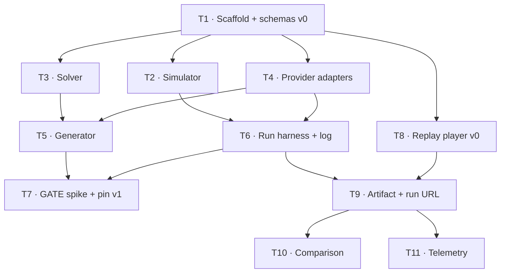

# Ticket Breakdown — LLM Escape Room (MVP)

**Date:** 2026-09-22 · **Sources:** [`llm-escape-room.prd.md`](../../llm-escape-room.prd.md) (intent) ·
[`architecture.md`](../../architecture.md) (approach, seams, data model, spikes)
**Codebase state at slicing time:** greenfield — three documents, no code. Every ticket creates new surface.

## Epic summary

Two models race through an identical, freshly generated escape room; the run is recorded as a semantic event log
and replays as a static side-by-side 3D page. Fairness comes from a deterministic simulator and one normalised
action vocabulary; cheapness comes from the replay never touching a provider. The MVP exists to find out whether
runs diverge enough to be worth watching.

## Scheduling note — the one-way doors stay open until the spike closes them

The PRD names `RoomSpec` and the event log as one-way doors. They are therefore built as **v0, deliberately
unpinned**, in TICKET-1 and only promoted to **v1** in TICKET-7, once the spike has proved which puzzle substrate
actually separates models. Downstream tickets code against v0 and expect one migration. This is the main reason
the spike lands mid-graph rather than first: the spike needs a harness, and the harness needs schemas — so the
schemas are built cheap and frozen late.

---

## GitHub issues

Tickets were created in dependency order, so **ticket numbers and issue numbers diverge** for TICKET-5 through
TICKET-9 — TICKET-8 was created fifth because it unblocks earliest. Cross-references inside the issue bodies use
issue numbers and are correct.

| Ticket | Issue | Wave |
|---|---|---|
| TICKET-1 | [#1](https://github.com/SachinthaRanasinghe/llm-escape-room/issues/1) | 1 |
| TICKET-2 | [#2](https://github.com/SachinthaRanasinghe/llm-escape-room/issues/2) | 2 |
| TICKET-3 | [#3](https://github.com/SachinthaRanasinghe/llm-escape-room/issues/3) | 2 |
| TICKET-4 | [#4](https://github.com/SachinthaRanasinghe/llm-escape-room/issues/4) | 2 |
| TICKET-5 | [#6](https://github.com/SachinthaRanasinghe/llm-escape-room/issues/6) | 3 |
| TICKET-6 | [#7](https://github.com/SachinthaRanasinghe/llm-escape-room/issues/7) | 3 |
| TICKET-7 | [#8](https://github.com/SachinthaRanasinghe/llm-escape-room/issues/8) | 4 — **gate** |
| TICKET-8 | [#5](https://github.com/SachinthaRanasinghe/llm-escape-room/issues/5) | 2 |
| TICKET-9 | [#9](https://github.com/SachinthaRanasinghe/llm-escape-room/issues/9) | 4 |
| TICKET-10 | [#10](https://github.com/SachinthaRanasinghe/llm-escape-room/issues/10) | 5 |
| TICKET-11 | [#11](https://github.com/SachinthaRanasinghe/llm-escape-room/issues/11) | 5 — blocked on a decision |

---

## Tickets

### TICKET-1 — Scaffold, core schemas (v0) and seeded determinism
- **Scope / AC:** pnpm + TypeScript + Next + vitest + Zod skeleton. `RoomSpec` v0, `Event` v0, `ActionVocabulary`,
  `Competitor`, `Run`, `RunSummary` as Zod schemas with inferred types. Seeded RNG utility such that
  `(seed, specVersion)` is reproducible. Golden fixture room + golden fixture event log committed, so every
  downstream ticket has something concrete to build and test against. Schema version field present and asserted.
- **Per-ticket context:** architecture → *Key decisions · Data model*; PRD → *Door check*. The fixtures are the
  contract between the backend tickets and the renderer ticket — treat them as the deliverable, not a by-product.
- **Files (est.):** `package.json`, `tsconfig`, `vitest.config`, `lib/schema/*`, `lib/rng.ts`, `fixtures/*`
- **Size:** ~400–700 lines (40% tests) · **Depends on:** none

### TICKET-2 — Room simulator and action resolution
- **Scope / AC:** compile a `RoomSpec` into a state machine. Resolve every action in the vocabulary against room
  state and return a verdict. Enforce the run budget (actions, tokens, wall clock) and record budget exhaustion
  as a recorded failure to escape, not a throw. **An invalid or malformed action returns a clear error and
  consumes a turn.** The simulator is the sole authority on state and never leaks room internals into what a
  competitor can see — prove that with a test.
- **Per-ticket context:** architecture → *Recommended approach*, *Boundaries & contracts* (simulator ↔ models,
  invalid actions, run budget). Uses TICKET-1 fixtures; needs no LLM.
- **Files (est.):** `lib/sim/*`, tests
- **Size:** ~800–1200 lines (35% tests) · **Depends on:** TICKET-1

### TICKET-3 — Solver / verifier (pure)
- **Scope / AC:** given a `RoomSpec`, prove it is solvable, that each puzzle answer is unique, that the chain is
  intact (each answer genuinely unlocks the next holder), and that it falls inside a difficulty band. Reject with
  a machine-readable reason. Property tests over hand-written valid specs, hand-written broken specs, and fuzzed
  ones. **No LLM, no network** — pure functions.
- **Per-ticket context:** architecture → *Missing pieces* ("gates the generator; nothing ships before it") and
  *Spikes · 1*. This is the ticket that makes "machine-checkable" true; the generator is worthless without it.
- **Files (est.):** `lib/solver/*`, tests
- **Size:** ~600–1000 lines (45% tests) · **Depends on:** TICKET-1

### TICKET-4 — Provider adapters and tool-spec equivalence
- **Scope / AC:** one adapter interface; Groq and Gemini implementations. Compile the single `ActionVocabulary`
  Zod schema into each provider's native tool-calling format. **An equivalence check proves the compiled specs
  describe the same task** and fails the build if they drift. Capture per-call tokens and real latency. Keys read
  from env in the harness only; a test asserts no key or endpoint can reach a published artifact.
- **Per-ticket context:** architecture → *Boundaries & contracts · Provider adapters*, and the open question on
  framing bias. This is the fairness seam — the equivalence check is the ticket's real deliverable.
- **Files (est.):** `lib/providers/*`, `lib/providers/equivalence.test.ts`
- **Size:** ~700–1100 lines (35% tests) · **Depends on:** TICKET-1

### TICKET-5 — Room generator (propose → verify → accept)
- **Scope / AC:** a generation model proposes a candidate `RoomSpec`; TICKET-3's solver accepts or rejects it;
  reject-and-regenerate until one passes or a retry cap trips. Emit structural-variety metadata per accepted room
  so the PRD's 90% variety metric is measurable. Count and log generation attempts — rejected candidates burn
  quota and that number feeds TICKET-7.
- **Per-ticket context:** architecture → *Recommended approach*, *Key decisions · Other calls* (puzzle substrate
  deliberately undecided). **Build it substrate-agnostic:** TICKET-7 picks the substrate, so this must accept more
  than one generator strategy behind a flag.
- **Files (est.):** `lib/generator/*`, tests with a stubbed provider
- **Size:** ~500–900 lines (35% tests) · **Depends on:** TICKET-3, TICKET-4

### TICKET-6 — Headless run harness and event log writer
- **Scope / AC:** run two competitors against one accepted spec. Each action carries a **required one-line intent**
  written by the model. Append-only semantic event log: sequence, competitor, action + args, intent, verdict, real
  latency, tokens. Emit `RunSummary` per competitor (escaped, escape time, actions, puzzles solved, failed
  attempts, invalid actions, tokens, cost). Support **silent repeats** of the same room and flag whether a given
  run was typical of them. A `tsx` CLI entry point; runs against a fixture spec without TICKET-5.
- **Per-ticket context:** architecture → *Recommended approach*, *Data model · Event / RunSummary*, *Other calls ·
  publication unit*. The log written here is what the renderer consumes — conform to TICKET-1's golden fixture.
- **Files (est.):** `lib/harness/*`, `scripts/run.ts`, tests
- **Size:** ~700–1100 lines (35% tests) · **Depends on:** TICKET-2, TICKET-4

### TICKET-7 — GATE: substrate divergence spike + quota instrumentation, then pin schemas to v1
- **Scope / AC:** implement symbolic, spatial and mixed generator strategies behind TICKET-5's flag. Run both
  candidate models across ~20 instances per strategy, headless, no rendering. **Decision rule:** adopt the
  substrate that diverges on ≥60% of instances with both models inside the action budget; if none clears it, the
  generator must target difficulty near the models' ceiling before anything else proceeds. Separately extrapolate
  calls and tokens for a full publishable matchup (hero run + silent repeats + rejected candidates) against
  free-tier quota; if it doesn't fit, cut in order — repeats, then generation retries, then chain length, and the
  60–90s watch target last. Write a decision record. **Then promote `RoomSpec` and `Event` from v0 to v1** and
  migrate the fixtures.
- **Per-ticket context:** architecture → *Spikes & experiments 1 and 2* (they share a harness, so they are one
  ticket) and *Missing pieces*. This ticket is allowed to conclude that the format doesn't work — that is the
  PRD's format-failure branch firing cheaply, and it is a successful outcome for this ticket.
- **Files (est.):** `lib/generator/strategies/*`, `scripts/spike-*.ts`, `docs/decisions/substrate.md`, schema bump
- **Size:** ~500–900 lines, plus analysis · **Depends on:** TICKET-5, TICKET-6

### TICKET-8 — Replay player v0 on a synthetic log
- **Scope / AC:** React Three Fiber side-by-side scene, two characters that move and interact, **beat scheduler**
  giving each action a uniform screen duration tuned so a typical run lands at 60–90s, the declared intent shown
  beside each character as it acts, and **real think-time displayed as a stat**. Driven entirely by TICKET-1's
  golden fixture log — **no backend dependency**. Absorbs architecture spike 3 (is a one-liner legible at beat
  pace): if it doesn't read, fix beat timing and typography, never summarise the model.
- **Per-ticket context:** architecture → *Recommended approach*, *Key decisions · Stack*, *Spikes · 3*. Motion
  discipline: the 3D scene earns real transitions; chrome around it stays restrained.
- **Files (est.):** `app/replay/*`, `components/scene/*`, `lib/replay/beats.ts`
- **Size:** ~800–1200 lines (25% tests) · **Depends on:** TICKET-1 *(parallel with the entire backend)*

### TICKET-9 — Published artifact: render manifest freeze + static run URL
- **Scope / AC:** emit the published artifact — event log + **frozen render manifest** (renderer version, assets,
  camera plan, beat timing) + summary — as versioned JSON. A static Next route loads an artifact by id and plays
  it. Assert the replay bundle makes **no provider call and carries no secret**. A published run must replay
  identically after the renderer changes — test that with a renderer-version bump.
- **Per-ticket context:** architecture → *Data model · RenderManifest*, *Boundaries · Replay ↔ artifact*. The
  manifest is what guarantees a published run never changes under a viewer's feet.
- **Files (est.):** `lib/artifact/*`, `app/run/[id]/*`, tests
- **Size:** ~500–900 lines (30% tests) · **Depends on:** TICKET-6, TICKET-8

### TICKET-10 — Post-run comparison and variance disclosure
- **Scope / AC:** the comparison view on the run page — per-model escape time, actions, puzzles solved, failed
  attempts, invalid actions, tokens, cost — plus a plain statement of **whether the published hero run was typical
  of its silent repeats**, and the nondeterminism limitation stated on the page.
- **Per-ticket context:** PRD → *MVP item 5*, *Success metrics*; architecture → *Other calls · publication unit*.
  Honesty about variance is the point; don't bury it in a tooltip.
- **Files (est.):** `components/comparison/*`, `app/run/[id]/*`
- **Size:** ~400–700 lines (25% tests) · **Depends on:** TICKET-9

### TICKET-11 — Watch-through telemetry
- **Scope / AC:** record opens, 30-second survival, and completion for a replay URL, so the PRD's first success
  metric has somewhere to land. **Blocked on an open decision** — the architecture deliberately leaves the
  telemetry home unchosen. Decide it before planning this ticket.
- **Per-ticket context:** PRD → *Success metrics · Watch-through*, and the wrong-condition "viewers drop inside
  the first 30 seconds". Architecture → *Missing pieces*, *Open questions*.
- **Files (est.):** `lib/telemetry/*`, replay player hook
- **Size:** ~300–500 lines · **Depends on:** TICKET-9 · **Also blocked on:** a telemetry decision

**Deferred, not sliced:** video export (a second reader of the same log), tournaments, difficulty tiers, hints,
adaptive mid-run events, more than two models, accounts.

---

## Dependency graph

## Suggested execution order

- **Wave 1:** TICKET-1 — alone, because it sets the contracts everything else codes against.
- **Wave 2 (parallel, four worktrees):** TICKET-2 · TICKET-3 · TICKET-4 · TICKET-8. No file overlap: simulator,
  solver, providers and renderer are four disjoint directories, and the renderer runs off fixtures rather than
  off the backend.
- **Wave 3 (parallel, two worktrees):** TICKET-5 (after 3 + 4) · TICKET-6 (after 2 + 4).
- **Wave 4:** TICKET-7 — **the gate. Run it before building further.** Its outcome can send TICKET-5 back for
  difficulty targeting, and it pins the schemas. TICKET-9 may run in parallel, since the artifact format does not
  depend on which substrate wins.
- **Wave 5 (parallel):** TICKET-10 · TICKET-11 (once the telemetry decision is made).

**Parallelism note:** wave 2 is the big win — TICKET-8 is the entire visual half of the product and depends only
on a fixture, so the thing you most want to look at early is never blocked by the backend.
